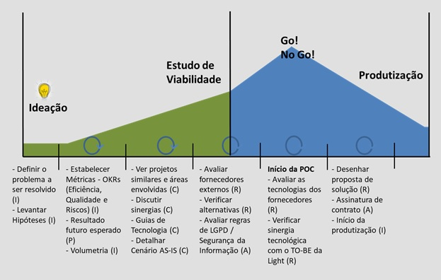

# Arquitetura de Sistemas Light

A Área de Arquitetura da Light tem a proposta de trazer as tecnologias mais recentes para dentro do nosso dia-a-dia. 
Para isso vamos trabalhar conjuntamente nos novos projetos e criando uma fundação para a futura migração dos sistemas existentes.

## Princípios da Arquitetura
Antes de entrarmos nos detalhes técnicos devemos explorar os princípios que vão nortear todas as nossas ações.
- Contract First 
- Reuso
- Desacoplamento de sistemas
- Event Driven
- Cloud Native
- Segurança de Dados
- Processos servindo pessoas
- Centralidade no Cliente
- Origem fiel dos dados

## Método de avaliação de projetos

A Área de Arquitetura trabalha com esta  metodologia para avaliar projetos:
 
**1 - Ideação  **
   1.1 - Entendimento das necessidades de negócio, processos e áreas afetadas.  
   1.2 - Entendimento dos benefícios ou problemas que se espera atingir.  
   1.3 - Métricas do estado atual e as métricas esperadas que justifiquem sua realização.  
   1.4 - Prazos, premissas, restrições e riscos envolvidos.  
   1.5 - Soluções atuais com as quais a nova solução necessite integrar.   

**2 - Estudo de Viabilidade  **
   2.1 - Avaliação do cenário atual AS-IS.  
   2.2 - Avaliação de projetos relacionados.  
      2.2.1 - Avaliação de Sinergias entre os projetos.  
   2.3 - Guias de direcionamentos de tecnologia.  
   2.4 - Aplicar Checklist com os Parceiros/Forncedores.  
   2.5 - Avaliar regras de Segurança e LGPD.  
   2.6 - Avaliação de POC.  

**3 - Direcionamento de Arquitetura.  **
   3.1 - Desenho de solução proposta futura TO-BE.  
   3.2 - Aprovação de contratação.  

**Ponto importante:  **
A avaliação de Arquitetura gera um direcionamento para as demandas e projetos com prazo de expiração. O direcionamento de hoje não se mantém ao longo dos anos, pois estamos em um mundo de constante mudanças.

