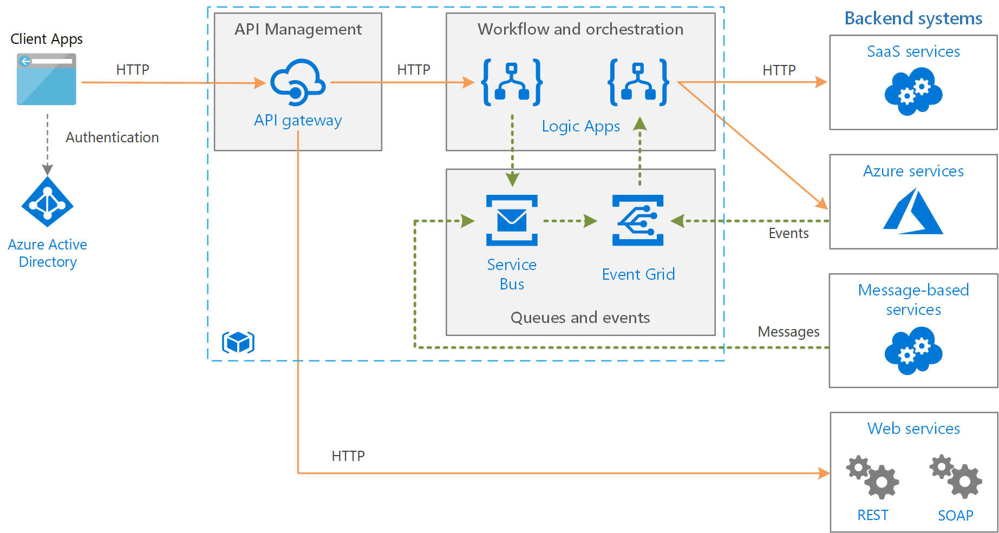

# Playbook - Integrações entre sistemas

A integração entre sistemas serve para simplificar a vida do usuário final, tornando a experiência simples e robusta, simplificando e uniformizando processos. 
Para tornar as integrações simples, escaláveis e eficientes ao longo do tempo, precisamos seguir padrões e boas práticas que detalhamos nesse documento.

# Tipos suportados de integração
1 - API Restfull
2 - Eventos
3 - Batch

# Etapas de Construção de APIs
**Brainstorm** - identificar as necessidades de negócios e quais os domínios da empresa que serão envolvidos para resolver o problema;

**Análise** - Descubra os tipos de APIs que devem ser construídos e quais serviços devem ser oferecidos por meio de APIs. Além disso, descubra e anote os casos de uso de cada API. Anote os endpoints em potencial com base nesses casos de uso.

**Identificar partes interessadas da API** - Quem são as partes interessadas em sua organização? Trabalha colaborativamente com as partes interessadas para opinar sobre o design da API. As partes interessadas podem então concordar com as interações em toda a organização para que as APIs permaneçam consistentes.

**Projetar um contrato de API** - O contrato estabelece um conjunto de padrões e práticas recomendadas para projetar APIs. Certifique-se de descrever e documentar todas as APIs. Certifique-se de que todas as APIs funcionem da mesma forma, de nomes de terminais e URLs a códigos de erro e controle de versão. Consistência é a chave. 
Confira o estilode forma a ter padronização nos códigos de status da API, controle de versão, tratamento de erros e muito mais serão padronizados, garantindo que as APIs sejam projetadas da mesma maneira. 

**Gerar Protótipo** - Utilizar o Swagger para gerar o contrato aos possíveis consumidores e a documentação da API, de forma a liberar as atividades das outras equipes para começarem a trabalhar. 

** Codificar
 Testes unitários, integrados, teste end-to-end e teste UI
 Documentação
 Produção**

# Desenho macro de Integração

